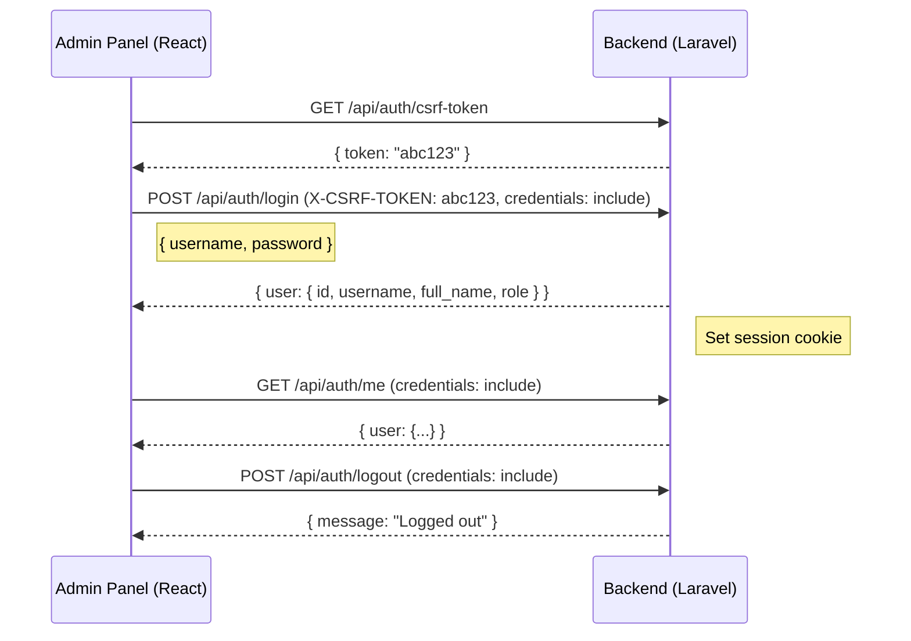

# VCET Website — Full Project Context

> **Purpose:** This document gives AI models (and human developers) a complete understanding of how the two repositories work together.

---

## 1. High-Level Architecture

```
┌──────────────────────────┐         JSON / REST          ┌──────────────────────────┐
│   FRONTEND (vcet.edu.in) │  ◄──── /api/* endpoints ───► │   BACKEND (vcet)         │
│   React 19 + Vite + TW4  │                              │   Laravel 12 + MySQL     │
│   Port 3000 (dev)        │                              │   Port 8000 (dev)        │
│   Deployed: Vercel        │                              │   Deployed: TBD          │
└──────────────────────────┘                              └──────────────────────────┘
```

- **Frontend repo:** `vcet.edu.in/` — Public college website + embedded admin CMS panel.
- **Backend repo:** `vcet/` — Pure REST JSON API. No server-side HTML; only serves data and file assets.
- **Communication:** Frontend talks to backend exclusively via `fetch()` calls to `/api/*` endpoints.
- **Auth:** Laravel Fortify (session-based) with CSRF tokens. The admin panel uses `credentials: 'include'` for cookie-based auth.

---

## 2. Tech Stacks

### Backend (`vcet/`)

| Layer | Technology |
|---|---|
| Framework | Laravel 12 (PHP 8.2+) |
| Database | MySQL (`vcet` database, root/root@123) |
| Auth | Laravel Fortify (session cookies + CSRF) |
| Session/Cache/Queue | Database-backed |
| File Storage | Local disk (`storage/app`) |
| Dev Server | `php artisan serve` → `http://127.0.0.1:8000` |
| Code Style | Laravel Pint |
| Key Packages | `inertiajs/inertia-laravel`, `laravel/fortify`, `laravel/wayfinder` |

### Frontend (`vcet.edu.in/`)

| Layer | Technology |
|---|---|
| Framework | React 19 with TypeScript |
| Bundler | Vite 6 |
| Styling | Tailwind CSS v4 |
| Routing | React Router DOM v7 (BrowserRouter) |
| Animations | Framer Motion / Motion |
| Icons | Lucide React, React Icons |
| Deployment | Vercel (`vercel.json` present) |
| Dev Server | `npm run dev` → `http://localhost:3000` |

---

## 3. Directory Structures

### Backend (`vcet/`)

```
vcet/
├── app/
│   ├── Http/Controllers/         # 13 controllers (see §5)
│   │   ├── Auth/                  # AdminAuthenticatedSessionController
│   │   └── Settings/              # User settings
│   └── Models/                    # 13 Eloquent models (see §4)
├── config/
│   └── cors.php                   # CORS config: allows localhost:3000, :5173, vercel domain
├── database/
│   └── migrations/                # 26 migration files
├── routes/
│   ├── api.php                    # All REST endpoints (see §5)
│   └── web.php                    # Root health-check + Inertia dashboard
├── storage/app/                   # Uploaded files (images, PDFs)
├── .env                           # DB creds, app config
├── composer.json                  # PHP dependencies
└── package.json                   # Node deps (for Inertia admin SSR, not actively used)
```

### Frontend (`vcet.edu.in/`)

```
vcet.edu.in/
├── App.tsx                        # Main router — 100+ routes, HomePage component
├── index.tsx                      # React DOM entry point
├── index.html                     # SPA shell
├── index.css                      # Global styles
├── components/                    # 27 shared/public UI components
│   ├── Header.tsx                 # Main navigation (60KB, mega-menu)
│   ├── Hero.tsx                   # Homepage hero slider (fetches API)
│   ├── DepartmentPage.tsx         # Dynamic department page
│   ├── DepartmentFacultySection.tsx
│   └── ... (About, Footer, Gallery, Placements, etc.)
├── pages/                         # Page-level components, organized by section
│   ├── about/                     # 8 pages
│   ├── admissions/                # 6 pages
│   ├── departments/               # 8+ department pages + faculty profiles
│   ├── academics/                 # 5 pages + exam/ sub-section
│   ├── research/                  # 11 pages
│   ├── facilities/                # 7 pages
│   ├── student-life/              # 13 pages
│   ├── clubs/                     # 6 pages
│   ├── committees/                # 10 pages
│   ├── naac/                      # 5 pages
│   ├── contact/                   # 1 page
│   ├── mms/                       # 40+ MMS department mini-site pages
│   └── FacultyProfile.tsx         # Dynamic faculty profile page
├── services/                      # PUBLIC data-fetching layer
│   ├── api.ts                     # Base fetch wrapper (get/post), uses VITE_API_BASE_URL
│   ├── publicData.ts              # Shared helpers (unwrapListResponse, sorting)
│   ├── notices.ts                 # noticesService.list()
│   ├── events.ts                  # eventsService
│   ├── heroSlides.ts              # heroSlidesService
│   ├── gallery.ts                 # galleryService
│   ├── achievements.ts            # achievementsService
│   ├── testimonials.ts            # testimonialsService
│   ├── newsTicker.ts              # newsTickerService
│   ├── placements.ts              # placementsService
│   └── placementPartners.ts       # placementPartnersService
├── admin/                         # ADMIN CMS panel (protected by auth)
│   ├── types.ts                   # 476 lines — ALL TypeScript interfaces matching backend
│   ├── api/                       # Admin API service layer
│   │   ├── client.ts              # Admin fetch client (CSRF, session cookies, file uploads)
│   │   ├── auth.ts                # Login, logout, me()
│   │   ├── notices.ts             # Full CRUD for notices
│   │   ├── events.ts              # Full CRUD for events
│   │   ├── faculty.ts             # Full CRUD for faculty
│   │   ├── departments.ts         # Full CRUD for departments
│   │   ├── heroSlides.ts          # Full CRUD for hero slides
│   │   ├── galleries.ts           # Full CRUD for galleries
│   │   ├── testimonials.ts        # Full CRUD for testimonials
│   │   ├── newsTicker.ts          # Full CRUD for news ticker
│   │   ├── achievements.ts        # Full CRUD for achievements
│   │   ├── placements.ts          # Full CRUD for placements
│   │   ├── placementStats.ts      # Placement year stats
│   │   ├── placementPartners.ts   # Placement partners
│   │   ├── enquiries.ts           # Read-only enquiries
│   │   └── mockStore.ts           # Local mock data for dev (VITE_MOCK_AUTH=true)
│   ├── components/                # Admin UI components (AdminLayout, ProtectedRoute, etc.)
│   ├── context/
│   │   └── AuthContext.tsx         # React Context for admin authentication
│   └── pages/                     # Admin CRUD pages (list + form for each resource)
├── context/
│   └── SiteDataContext.tsx         # Global site data context
├── hooks/                         # Custom React hooks
├── utils/                         # Utility functions
├── .env.local                     # VITE_DEV_BYPASS=true
├── vite.config.ts                 # Vite config (port 3000, Tailwind plugin, @ alias)
└── package.json                   # NPM dependencies
```

---

## 4. Database Models & Tables

| # | Model | Table | Key Fields |
|---|---|---|---|
| 1 | `User` | `users` | id, username, full_name, role (`super`/`editor`), password |
| 2 | `Notice` | `notices` | title, body, type, link_url, pdf fields, is_active, deactivates_at, sort_order |
| 3 | `Event` | `events` | title, organizer, description, date, time, venue, image, category, status, is_featured, is_active, expiry_date, attachment, external_link |
| 4 | `Placement` | `placements` | company, logo, package_lpa, student_count, year, is_active |
| 5 | `PlacementYearStat` | `placement_year_stats` | year, total_placed, total_students (unique year constraint) |
| 6 | `HeroSlide` | `hero_slides` | title, subtitle, image (stored on disk), button_text, button_link, sort_order, is_active |
| 7 | `Gallery` | `galleries` | title, subtitle, image (stored on disk), sort_order, is_active |
| 8 | `Testimonial` | `testimonials` | name, role, text, photo (stored on disk), rating, is_active |
| 9 | `NewsTicker` | `news_tickers` | text, link, is_active, sort_order |
| 10 | `Achievement` | `achievements` | title, value, participant_name, participant_avatar, participant_role, date, category, document_name, document_url, description, icon, sort_order, is_active |
| 11 | `AdmissionEnquiry` | `admission_enquiries` | name, email, phone, message, course |
| 12 | `Department` | `departments` | name, slug, content (JSON blob with about, vision, mission, faculty IDs, toppers, etc.), is_active |
| 13 | `Faculty` | `faculty` | slug, data (JSON blob with nested structure: basicInfo, qualifications, experience, academic, publications, rolesAndAwards, onlineLinks, memberships), profile_image_path |

---

## 5. API Endpoint Map

All endpoints are prefixed with `/api`. Backend serves at `http://localhost:8000/api/*`.

### Authentication (session + CSRF)

| Method | Path | Auth | Description |
|---|---|---|---|
| `GET` | `/auth/csrf-token` | — | Returns `{ token: "..." }` for CSRF |
| `POST` | `/auth/login` | — | `{ username, password }` → `{ user }` |
| `GET` | `/auth/me` | ✅ | Returns `{ user }` for current session |
| `POST` | `/auth/logout` | ✅ | Ends session |

### Notices

| Method | Path | Auth | Description |
|---|---|---|---|
| `GET` | `/notices` | — | Public: active notices list |
| `GET` | `/notices/{id}/pdf` | — | Public: download notice PDF |
| `GET` | `/notices/all` | ✅ | Admin: all notices (incl. inactive/deleted) |
| `POST` | `/notices` | ✅ | Admin: create notice |
| `PATCH` | `/notices/{id}` | ✅ | Admin: update notice |
| `PATCH` | `/notices/{id}/activate` | ✅ | Admin: activate |
| `PATCH` | `/notices/{id}/deactivate` | ✅ | Admin: deactivate |
| `PATCH` | `/notices/{id}/deactivates-at` | ✅ | Admin: set auto-deactivation time |
| `DELETE` | `/notices/{id}` | ✅ | Admin: soft delete |
| `POST` | `/notices/{id}/restore` | ✅ | Admin: restore deleted |

### Events

| Method | Path | Auth | Description |
|---|---|---|---|
| `GET` | `/events` | — | Public: active events |
| `GET` | `/events/{id}/image` | — | Public: serve event image |
| `GET` | `/events/{id}/attachment` | — | Public: serve event attachment |
| `GET` | `/events/all` | ✅ | Admin: all events |
| `POST` | `/events` | ✅ | Admin: create |
| `PUT/PATCH` | `/events/{id}` | ✅ | Admin: update |
| `DELETE` | `/events/{id}` | ✅ | Admin: delete |

### Placements

| Method | Path | Auth | Description |
|---|---|---|---|
| `GET` | `/placements` | — | Public: active placements |
| `GET` | `/placements/all` | ✅ | Admin: all |
| `POST` | `/placements` | ✅ | Admin: create |
| `PUT/PATCH` | `/placements/{id}` | ✅ | Admin: update |
| `DELETE` | `/placements/{id}` | ✅ | Admin: delete |

### Placement Year Stats

| Method | Path | Auth | Description |
|---|---|---|---|
| `GET` | `/placement-year-stats` | — | Public: stats for homepage chart |
| `POST` | `/placement-year-stats` | ✅ | Admin: create |
| `PATCH` | `/placement-year-stats/{id}` | ✅ | Admin: update |
| `DELETE` | `/placement-year-stats/{id}` | ✅ | Admin: delete |

### Hero Slides

| Method | Path | Auth | Description |
|---|---|---|---|
| `GET` | `/hero-slides` | — | Public: active slides |
| `GET` | `/hero-slides/{id}` | — | Public: single slide |
| `GET` | `/hero-slides/{id}/image` | — | Public: serve slide image |
| `POST` | `/hero-slides` | ✅ | Admin: create |
| `POST/PUT/PATCH` | `/hero-slides/{id}` | ✅ | Admin: update |
| `DELETE` | `/hero-slides/{id}` | ✅ | Admin: delete |

### Galleries

| Method | Path | Auth | Description |
|---|---|---|---|
| `GET` | `/galleries` | — | Public: active gallery items |
| `GET` | `/galleries/{id}` | — | Public: single item |
| `GET` | `/galleries/{id}/image` | — | Public: serve image |
| `POST` | `/galleries` | ✅ | Admin: create |
| `POST/PUT/PATCH` | `/galleries/{id}` | ✅ | Admin: update |
| `DELETE` | `/galleries/{id}` | ✅ | Admin: delete |

### Testimonials

| Method | Path | Auth | Description |
|---|---|---|---|
| `GET` | `/testimonials` | — | Public: active testimonials |
| `GET` | `/testimonials/{id}` | — | Public: single |
| `GET` | `/testimonials/{id}/image` | — | Public: serve photo |
| `POST` | `/testimonials` | ✅ | Admin: create |
| `POST/PUT/PATCH` | `/testimonials/{id}` | ✅ | Admin: update |
| `DELETE` | `/testimonials/{id}` | ✅ | Admin: delete |

### News Ticker

| Method | Path | Auth | Description |
|---|---|---|---|
| `GET` | `/news-ticker` | — | Public: active ticker items |
| `GET` | `/news-ticker/all` | ✅ | Admin: all |
| `POST` | `/news-ticker` | ✅ | Admin: create |
| `POST/PUT/PATCH` | `/news-ticker/{id}` | ✅ | Admin: update |
| `DELETE` | `/news-ticker/{id}` | ✅ | Admin: delete |

### Achievements

| Method | Path | Auth | Description |
|---|---|---|---|
| `GET` | `/achievements` | — | Public: active achievements |
| `GET` | `/achievements/all` | ✅ | Admin: all |
| `POST` | `/achievements` | ✅ | Admin: create |
| `POST/PUT/PATCH` | `/achievements/{id}` | ✅ | Admin: update |
| `DELETE` | `/achievements/{id}` | ✅ | Admin: delete |

### Departments

| Method | Path | Auth | Description |
|---|---|---|---|
| `GET` | `/departments` | — | Public: active departments |
| `GET` | `/departments/slug/{slug}` | — | Public: find by URL slug |
| `GET` | `/departments/{id}` | — | Public: find by ID |
| `GET` | `/departments/all` | ✅ | Admin: all |
| `POST` | `/departments` | ✅ | Admin: create |
| `PUT/PATCH` | `/departments/{id}` | ✅ | Admin: update |
| `DELETE` | `/departments/{id}` | ✅ | Admin: delete |

### Faculty

| Method | Path | Auth | Description |
|---|---|---|---|
| `GET` | `/faculty` | — | Public: all active faculty |
| `GET` | `/faculty/{id}` | — | Public: single faculty profile |
| `GET` | `/faculty/all` | ✅ | Admin: all |
| `POST` | `/faculty` | ✅ | Admin: create |
| `PUT/PATCH` | `/faculty/{id}` | ✅ | Admin: update |
| `DELETE` | `/faculty/{id}` | ✅ | Admin: delete |

### Enquiries

| Method | Path | Auth | Description |
|---|---|---|---|
| `POST` | `/enquiries` | — | Public: submit admission enquiry |
| `GET` | `/enquiries` | ✅ | Admin: list all enquiries |

---

## 6. API Response Envelope

All responses follow a standard envelope:

```typescript
// List responses
{ success: boolean, data: T[], meta?: { current_page, last_page, total, per_page } }

// Single item responses
{ success: boolean, data: T, message?: string }

// Delete / action responses
{ success: boolean, message: string }
```

The frontend's `unwrapListResponse<T>()` helper handles both raw arrays and `{ data: [...] }` wrappers.

---

## 7. How Frontend Connects to Backend

### Public Pages (services/)

```
services/api.ts
├── API_BASE = VITE_API_BASE_URL ?? 'http://localhost:8000'
├── get<T>(path)  → fetch(`${API_BASE}/api${path}`, { Accept: 'application/json' })
└── post<T>(path) → fetch(`${API_BASE}/api${path}`, { method: 'POST', ... })
```

Each service file (e.g. `services/notices.ts`) imports `get()` from `api.ts` and calls public endpoints:
```typescript
// Example: services/notices.ts
const notices = unwrapListResponse<NoticeRecord>(await get<unknown>('/notices'));
```

### Admin Panel (admin/api/)

```
admin/api/client.ts
├── API_BASE = (VITE_API_URL ?? 'https://vcet.edu.in') + '/api'
├── client.request<T>(path, options)    → JSON requests with CSRF
├── client.requestForm<T>(path, body)   → FormData (file uploads) with CSRF
└── CSRF Flow:
    1. GET /api/auth/csrf-token → { token }
    2. Attach X-CSRF-TOKEN header + credentials: 'include' on mutations
    3. Auto-retry on 419 (token expired)
```

### Environment Variables

| Variable | Where | Default | Purpose |
|---|---|---|---|
| `VITE_API_BASE_URL` | Frontend `.env.local` | `http://localhost:8000` | Public API base URL |
| `VITE_API_URL` | Frontend `.env.local` | `https://vcet.edu.in` | Admin API base URL |
| `VITE_DEV_BYPASS` | Frontend `.env.local` | `true` | Dev mode flag |
| `VITE_MOCK_AUTH` | Frontend `.env.local` | (unset) | When `true`, uses localStorage mock data |
| `FRONTEND_URL` | Backend `.env` | `http://localhost:3000` | CORS allowed origin |
| `DB_*` | Backend `.env` | MySQL localhost | Database connection |

### CORS Configuration (`config/cors.php`)

- Allowed origins: `localhost:3000`, `localhost:5173`, `https://vcet-edu-in.vercel.app`
- `supports_credentials: true` (required for session cookies)
- All standard methods and headers allowed

---

## 8. Authentication Flow



- Roles: `super` (full access) and `editor` (limited)
- `AuthContext.tsx` wraps the entire app, calls `/auth/me` on mount to restore session
- `ProtectedRoute` component redirects to `/admin/login` if not authenticated

---

## 9. Data Flow: Example — Hero Slides

### Public (Homepage)

1. `Hero.tsx` mounts → calls `heroSlidesService.list()`
2. `heroSlidesService` → `get('/hero-slides')` via `services/api.ts`
3. Backend `HeroSlideController@index` → returns active slides ordered by `sort_order`
4. Component renders carousel with images from `/api/hero-slides/{id}/image`

### Admin (CMS)

1. `HeroSlidesList.tsx` → calls `heroSlidesApi.list()` via `admin/api/heroSlides.ts`
2. `heroSlidesApi` → `client.request('/hero-slides', { method: 'GET' })`
3. Admin can create/edit/delete via form pages
4. File uploads use `client.requestForm()` with `FormData`

---

## 10. Key Frontend Routes

### Public Routes (`/`)
| Area | Example Routes |
|---|---|
| Homepage | `/` |
| About | `/about-us`, `/presidents-desk`, `/principals-desk`, `/governing-council` |
| Admissions | `/courses-and-intake`, `/fees-structure`, `/scholarships`, `/brochure` |
| Departments | `/computer-engineering`, `/cs-data-science`, `/information-technology`, etc. |
| Faculty | `/{dept}/faculty/:slug` (per-department), `/faculty/:id` (global) |
| Academics | `/dean-academics`, `/academic-calendar`, `/exam/*` (9 sub-routes) |
| Research | `/research`, `/funded-research`, `/publications`, `/patents`, `/nirf` |
| Facilities | `/central-computing`, `/library`, `/counseling-cell` |
| Student Life | `/cultural-committee`, `/sports-committee`, `/nss`, `/hackathon` |
| Clubs | `/ieee`, `/csi`, `/iete`, `/ishrae`, `/vmea`, `/igbc` |
| Committees | `/iqac`, `/anti-ragging`, `/grievance-redressal`, + 7 more |
| NAAC | `/ssr-cycle-1`, `/ssr-cycle-2`, `/best-practices`, `/naac-score` |
| MMS | `/mms/*` (40+ routes for MMS department mini-site) |
| Contact | `/contact-us` |

### Admin Routes (`/admin/*`)
| Route | Page |
|---|---|
| `/admin/login` | Login form |
| `/admin` | Dashboard |
| `/admin/notices` | Notices list → `/admin/notices/new`, `/admin/notices/:id/edit` |
| `/admin/events` | Events list → `new`, `:id/edit` |
| `/admin/placements` | Placements list → `new`, `:id/edit` |
| `/admin/hero-slides` | Hero slides list → `new`, `:id/edit` |
| `/admin/galleries` | Galleries list → `new`, `:id/edit` |
| `/admin/news-ticker` | News ticker list → `new`, `:id/edit` |
| `/admin/achievements` | Achievements list → `new`, `:id/edit` |
| `/admin/testimonials` | Testimonials list → `new`, `:id/edit` |
| `/admin/placement-partners` | Placement partners list → `new`, `:id/edit` |
| `/admin/enquiries` | Enquiries list (read-only) |
| `/admin/pages/faculty` | Faculty list → `create`, `:id/edit` |
| `/admin/pages/departments/*` | Department management |
| `/admin/home/placement-stats` | Placement year statistics |

---

## 11. File Upload & Image Serving Pattern

1. **Upload:** Admin sends `FormData` via `client.requestForm()` → backend stores file in `storage/app/` (e.g., `hero_slides/`, `galleries/`, `testimonials/`)
2. **Database:** Stores relative path (e.g., `hero_slides/abc123.jpg`)
3. **Serving:** Public endpoint `/api/{resource}/{id}/image` → controller reads file from disk and returns binary with correct MIME type
4. **Frontend resolution:** `resolveApiUrl(path)` converts relative paths to full URLs (e.g., `/storage/hero_slides/abc.jpg` → `http://localhost:8000/storage/hero_slides/abc.jpg`)

---

## 12. Development Setup

### Quick Start

```bash
# Terminal 1 — Backend
cd vcet/
composer install
cp .env.example .env          # Configure DB_* values
php artisan key:generate
php artisan migrate
php artisan serve              # → http://127.0.0.1:8000

# Terminal 2 — Frontend
cd vcet.edu.in/
npm install
# Create .env.local with:
#   VITE_API_BASE_URL=http://localhost:8000
#   VITE_API_URL=http://localhost:8000
npm run dev                    # → http://localhost:3000
```

### Database

- MySQL on `127.0.0.1:3306`
- Database name: `vcet`
- Credentials: `root` / `root@123`

---

## 13. Key Conventions

1. **TypeScript types as source of truth:** `admin/types.ts` defines ALL data shapes. Backend responses must match these interfaces.
2. **Nested JSON fields:** `Faculty.data` and `Department.content` are stored as JSON blobs in MySQL, not as relational tables.
3. **Slug-based routing:** Faculty has `slug` field for SEO-friendly URLs (e.g., `/cs-data-science/faculty/john-doe`).
4. **Soft deletes:** Notices support soft deletes (`deleted_at` field + restore endpoint).
5. **Active/Inactive pattern:** Most resources have `is_active` boolean + optional `deactivates_at` timestamp for auto-deactivation.
6. **Sort order:** Many resources have `sort_order` field for admin-controlled ordering.
7. **Mock data mode:** Setting `VITE_MOCK_AUTH=true` in frontend `.env.local` uses `localStorage` mock data instead of hitting the API — useful for frontend-only development.

---

## 14. What is NOT Yet Implemented

Based on `admin/types.ts`, these types exist but may not have full backend support:

- **PlacementPartner** — types and admin pages exist, backend controller status unclear
- **GalleryImage** — separate type from Gallery; may represent a future multi-image gallery feature

---

*Last updated: March 2026*
